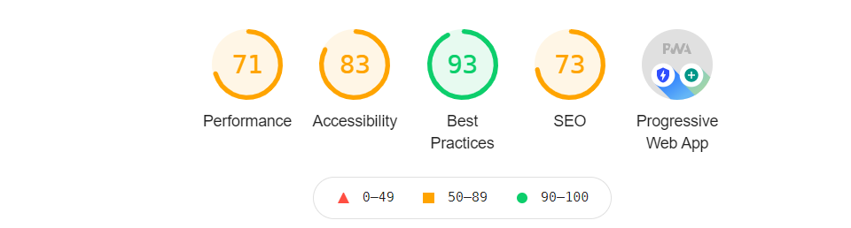
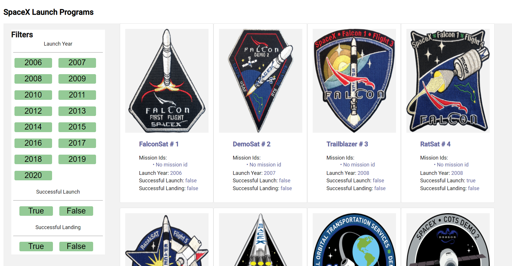
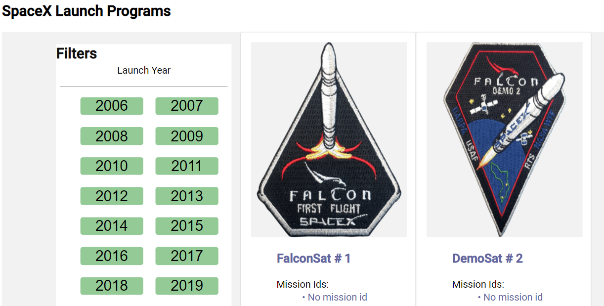
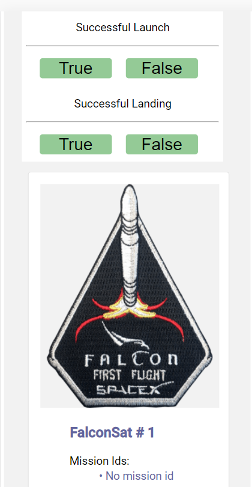

# SpaceXApp

An application which lists out all the missions launched by Space X along with the filter functionality which provides launch details year wise, launch and landing. 

## How to run the project?
* Git clone
* Run `npm install`
* Run `npm run build:ssr && npm run serve:ssr`
* Run `ng test` for unit testing

## Technologies used
- Angular 8
- Node JS express for backend
- Server Side Rendering Using Angular Universal
- Progressive Web App (PWA)
- Custom Media queries for responsiveness (no 3rd party library used)
- Webpack as module bundler
- Karma Jasmine for Unit testing
- Heroku for Deployment

## Deployed URL:

http://space-x-app-shashank.herokuapp.com/

## Light house score

## Desktop

## Tablet

## Mobile

